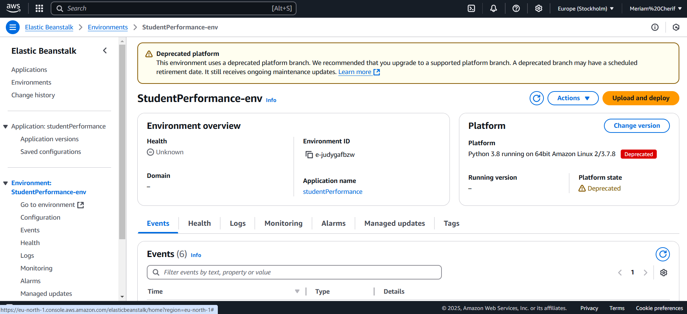

## Student Performance Prediction
This project is a machine learning application that predicts student performance based on various input features. The application is deployed on AWS Elastic Beanstalk using CodePipeline.

## Table of Contents
- [Installation](#installation)
- [Usage](#usage)
- [Pipeline](#pipeline)
- [Deployment on AWS](#deployment-on-aws)
## Installation

### Prerequisites
Ensure you have the following installed:
- Python (>= 3.7)
- pip
- Virtualenv
- AWS CLI configured with proper credentials
- GitHub repository for deployment

### Setup
1. Clone the repository:
   ```bash
   git clone https://github.com/meriamcherif/mlproject
   cd mlproject
   ```
2. Create a virtual environment:
   ```bash
   python -m venv venv
   venv\Scripts\activate
   ```
3. Install dependencies:
   ```bash
   pip install -r requirements.txt
   ```

## Usage
1. Run the Flask application locally:
   ```bash
   python application.py
   ```
2. Open a browser and navigate to `http://127.0.0.1:5000`.
3. Enter student data and get the predicted math score.


##  Pipeline
1. **Data Ingestion** (`data_ingestion.py`) - Reads the dataset, splits into training and testing sets.
2. **Data Transformation** (`data_transformation.py`) - Processes categorical and numerical features.
3. **Model Training** (`model_trainer.py`) - Trains multiple regression models and selects the best one based on R² score.
4. **Prediction Pipeline** (`predict_pipeline.py`) - Loads trained model and preprocessor for making predictions.


## Deployment on AWS

### Steps to Deploy
1. **Create AWS Elastic Beanstalk Environment**
   - Go to AWS Elastic Beanstalk and create an application.
   - Select Python as the platform.
   - Deploy an initial version manually or through AWS CodePipeline.
 

2. **Setup AWS CodePipeline**
   - Connect Elastic Beanstalk to your GitHub repository.
   - Configure build and deployment steps.
   - Every push to the main branch triggers an automatic deployment.

3. **Monitor Deployment**
   - Check AWS Elastic Beanstalk logs for errors.
   - Monitor pipeline execution in AWS CodePipeline.
 


